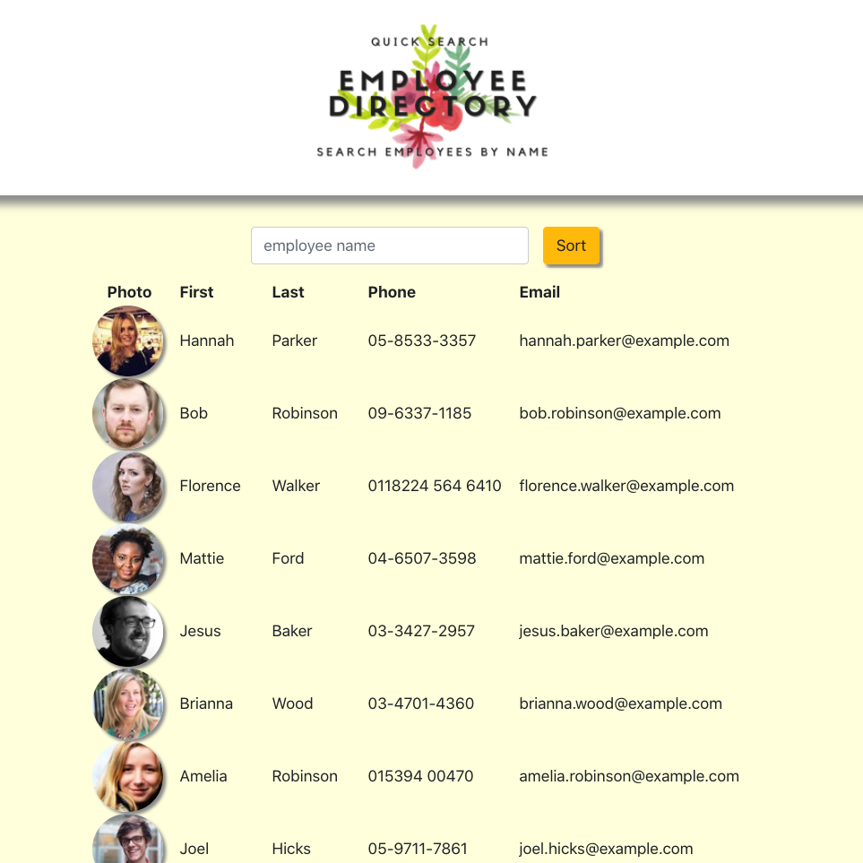

               

# React Employee Directory
An employee directory application using React to create UI components, manage component state and respond to user input events. 

## Project Links
[Repo Link](https://github.com/onomatopoetica/react-employee-directory)  
**NOTE:** The deployed app can be found on [GitHub Pages](https://onomatopoetica.github.io/react-employee-directory/). Please see the [Getting Started](#Getting-Started) section for more information regarding installation, usage, contribution guidelines and where to go for questions.
    
## Table of Contents
1. [About The Project](#About-The-Project)
1. [Project Links](#Project-Links)
1. [Demo](#Demo)
1. [Getting Started](#Getting-Started)
1. [Installation](#Installation)
1. [Usage](#Usage)
1. [Contribution Guidelines](#Contribution-Guidelines)
1. [Questions](#Questions)
1. [Project Status](#Project-Status)
1. [License](#License)

## About The Project

The scope of this project was to render a table of (random) employees generated from the [Random User API](https://randomuser.me/). When a user loads the page, a table of employees is rendered.

A user can:

* Sort the table by pressing the sort button to scroll through employees, or

* Filter employees by entering an employee name,

* Or, simply begin entering letters in an employee's name and result will begin to render in the table.

## Demo

#### The following is an overview of the application in operation and rendering of the employee directory app. 
    
  

#### The following is a screenshot of the application and overview of its functionality:  

 

## Getting Started
    
#### Technologies used in this project include:
* React
* Random User API 
* Node
* Axios
    
## Installation: 
 
#### Clone Repository

* `git clone https://github.com/onomatopoetica/react-employee-directory.git`

#### Install Dependencies 

* Ensure you have [Node.js](https://nodejs.org) installed on your machine. 

* `npx create-react-app react-employee-directory` to install React for the project.

* All NPM packages required for this application are already listed as dependencies in the `package.json` file. Run the command `npm install` command in your terminal at the root directory level to install the packages.

#### Start Application

* Once React and dependencies are installed, cd into your directory (if not already there) and run `npm start` to view the project on http://localhost:3000/.
 

### _Return to [Table of Contents](#Table-of-Contents)_
 
  
## Usage 

* See [About The Project](#About-The-Project) or [Demo](#Demo) video above for more information on how it works.
* View [Project Links](#Project-Links) above for the link to the deployed app on Heroku.

## Contribution Guidelines

* When contributing to this repository, please contact the project team for review of your contribution plan. See contact details below.

## Questions 
#### Connect With Me:  

#### [Onomatopoetica](https://github.com/onomatopoetica)  
   

    
Contact

    jendotb@gmail.com

## Project Status

    
Current Project Activity

    Active

 

### _Return to [Table of Contents](#Table-of-Contents)_
 
    
## License
#### Distributed under the MIT License. See `LICENSE` for more information.

##### This README was generated with :hearts:&nbsp; by [Good README Generator](https://github.com/onomatopoetica/Good-README-Generator).